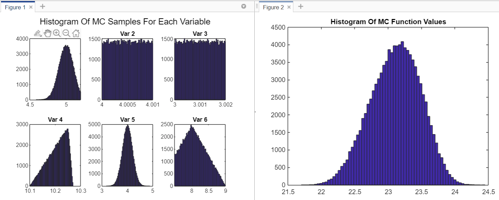

# simulateMC

simulateMC() is a tool to generate samples from user-specified distributions and combine the samples through an arbitrary function in MATLAB. 
It can also be used as a tool for propagation of uncertainty or just for generating correlated samples.

simulateMC() does the following:
* Supports most/all of the distribution types in MATLAB's statistics and machine learning toolbox, including truncated distributions.
* Can generate correlated samples from any combination of distributions via a gaussian copula approach with iterative optimization of correlation parameters
* Supports bootstrapping samples from data
* Supports fitting distributions to data and drawing samples from the fitted distribution
* Supports custom sample inputs
* Finds confidence intervals and descriptive statistics
* Allows for visualization of the uncertainty distributions using histogram plots.

## Usage
Explanations of syntax and simple examples are included in the comments of the function file. More detailed examples can be found in the included file 'simulateMC_examples.m'.
